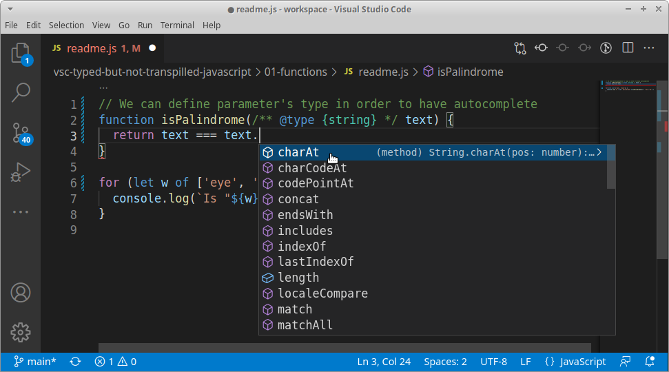
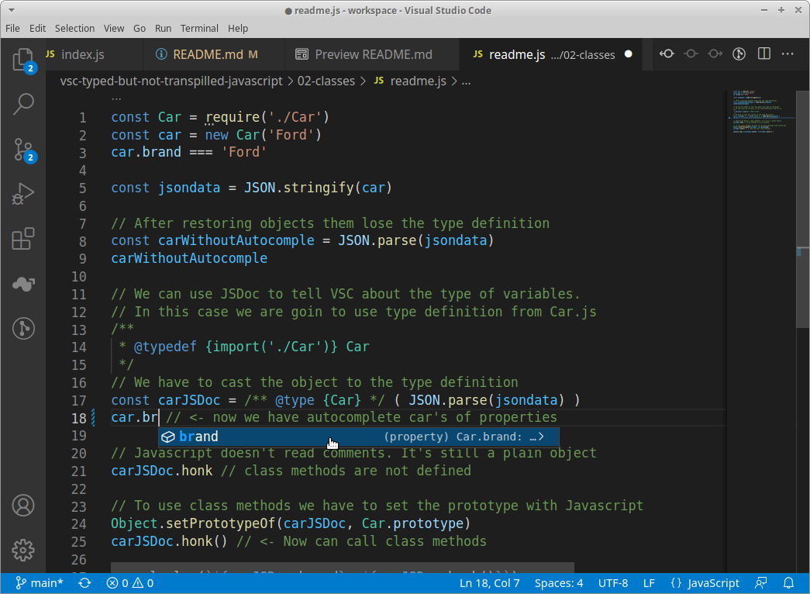
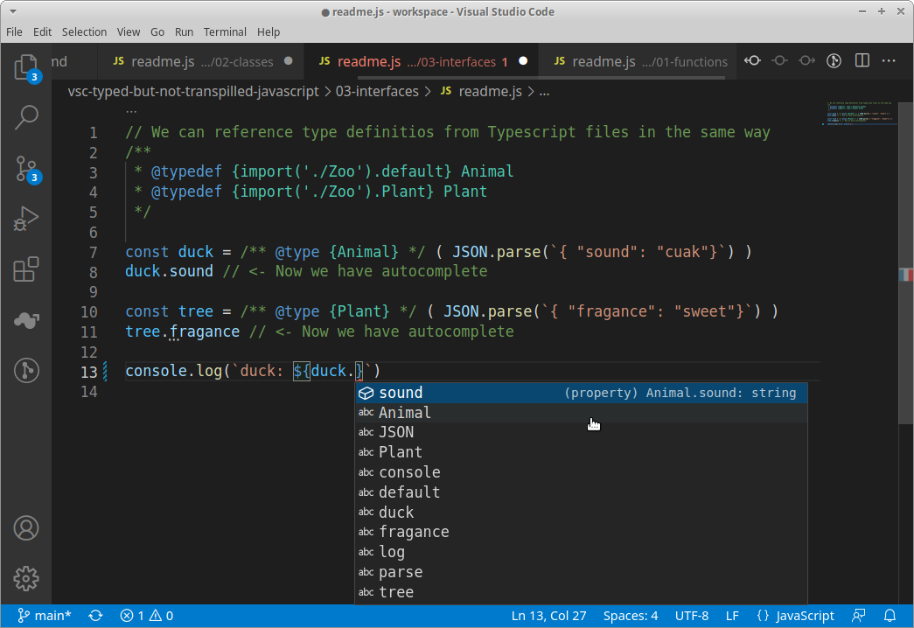
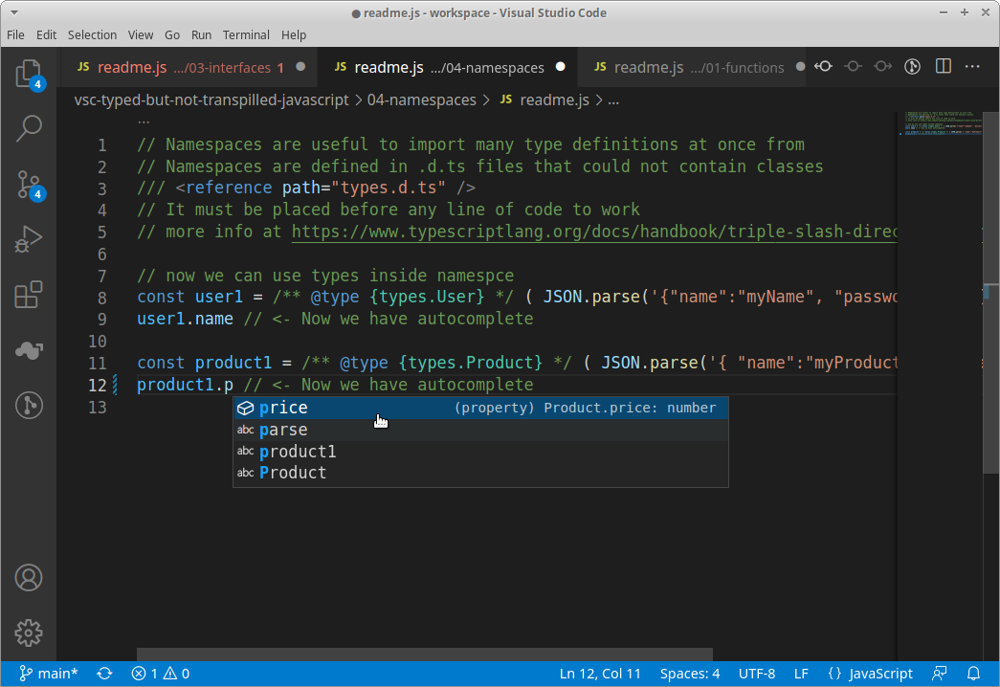
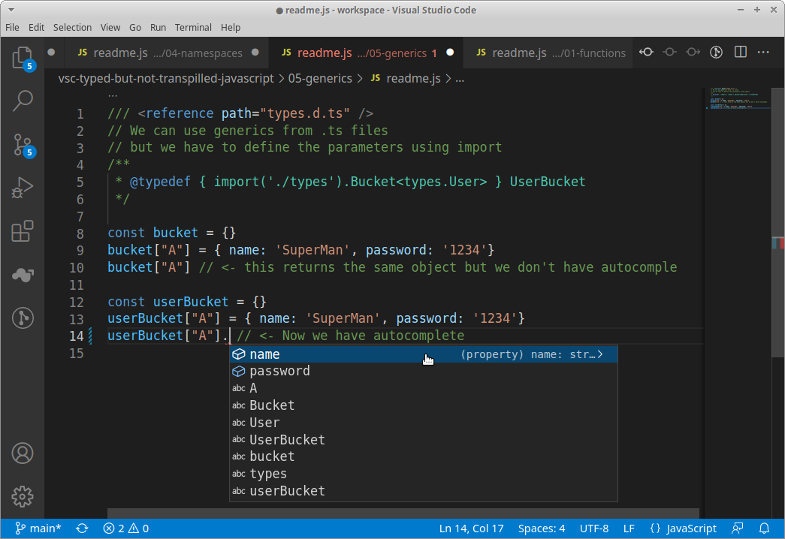

# VSC Typed (but not transpilled) Javascript

Thanks to VSC we can use almost every Typescript feature directly inside Javascript files thanks to JSDoc annotations

```javascript
/** 
 * like this 
 */

/* not like this */
```

[Update 2022: Microsoft proposal at ECMAScript to implement typing on runtime using annotations ](https://devblogs.microsoft.com/typescript/a-proposal-for-type-syntax-in-javascript/)

Types definitions help to structure the code giving better autocomplete in code editors like VSC. 

We can import type definitions from .ts files, even from 3rd party libraries inside our project.

### Import types

```javascript
/** 
 * @typedef {import('./filePath').default} MyType
 */
```

### Setting variable type

```javascript
const x = /** @type {MyType} */ (value)
```

IMPORTANT don't forget to souround value inside parenthesis.

### Samples

[](https://github.com/sselvaggi/vsc-typed-but-not-transpilled-javascript/tree/main/01-functions)


[](https://github.com/sselvaggi/vsc-typed-but-not-transpilled-javascript/tree/main/02-classes)


[](https://github.com/sselvaggi/vsc-typed-but-not-transpilled-javascript/tree/main/03-interfaces)


[](https://github.com/sselvaggi/vsc-typed-but-not-transpilled-javascript/tree/main/04-namespaces)


[](https://github.com/sselvaggi/vsc-typed-but-not-transpilled-javascript/tree/main/05-generics)
